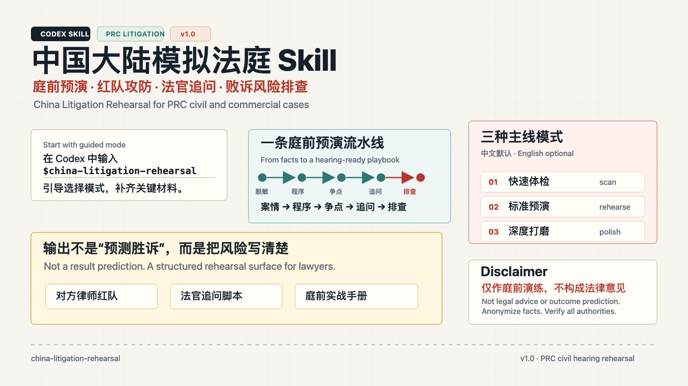

<p align="center">
  
</p>

# china-litigation-rehearsal · 中国大陆模拟法庭 Skill

中国大陆民商事诉讼庭前预演与败诉风险排查 Codex Skill。它面向律师的庭前准备场景，默认以交互引导开始，帮助你把脱敏案情转化为可操作的争点地图、程序风险清单、证据薄弱点、对方攻击路径、法官追问、关键人物演练和庭前实战手册。

China Litigation Rehearsal is a Codex Skill for PRC civil/commercial litigation rehearsal. It helps lawyers stress-test case theory, evidence, procedural gates, judge questions, and hearing preparation.

## 它能做什么

| 能力 | 适合什么时候用 | 产出 |
| --- | --- | --- |
| 交互引导 | 刚安装、不知道从哪里开始 | 模式选择、信息收集清单、下一步菜单 |
| 快速体检 | 开庭前时间紧，想先抓大风险 | 程序闸门、争点初筛、证据缺口、优先行动 |
| 标准预演 | 已有基本案情和证据目录，准备完整庭前推演 | 对方律师红队、法官追问、败诉风险排查、庭前手册 |
| 深度打磨 | 重要案件或疑难案件，需要反复压测 | 关键人物演练、二轮反击、口头表达、和解/上诉敏感点 |
| 单点训练 | 只想练一个环节 | 只输出法官追问、红队攻击、证据矩阵、关键人物发问等 |
| 实战手册整理 | 已有多轮分析，需要整合成开庭材料 | 开庭议程、发问提纲、答问稿、核验清单、行动表 |

## 核心模块

- 程序闸门：管辖、仲裁条款、诉讼时效、保全、鉴定、送达、开庭准备。
- 争点地图：请求权基础、抗辩路径、事实争点、法律争点、证明压力。
- 证据矩阵：待证事实、举证责任、现有证据、证据缺口、补强动作。
- 对方律师红队：从对方角度攻击事实、证据、程序、金额、因果关系和合同解释。
- 法官追问：按法官认知顺序组织问题，训练 `30秒`、`60秒`、`3分钟`回答。
- 关键人物演练：为法定代表人、经办人、员工、证人准备真实、清晰、不越界的表达。
- 败诉风险排查：倒推可能不被支持的理由，按构成要件拆解风险链条。
- 庭前实战手册：把前述内容整理成开庭当天可直接使用的工作手册。
- 法律依据核验：只提供检索方向，不把未经核验的条号、案例当作确定依据。

## 方法论与资料来源

本 Skill 不是一个“法条答案库”，而是一个庭前预演工作流。它把中国大陆民商事诉讼中的请求权基础、要件事实、举证责任、程序闸门和庭审表达训练组织成可重复使用的步骤。

核心方法路径：

```text
固定诉求 → 识别法律关系 → 拆解构成要件 → 整理争点 → 分配举证责任
→ 检查证据链 → 预判对方攻击 → 模拟法官追问 → 倒推败诉风险 → 形成庭前手册
```

主要方法论和资料对应关系：

| 方法/资料 | 对应文件 | 在 Skill 中的作用 |
| --- | --- | --- |
| 邹碧华《要件审判九步法》 | [`references/nine-step-method.md`](references/nine-step-method.md) | 法官追问、败诉风险排查、要件归入分析的核心框架 |
| 段厚省《论民事案件裁判方法》 | [`references/duan-housheng-adjudication-methods.md`](references/duan-housheng-adjudication-methods.md) | 支撑默认采用“先找法、后查事实”的裁判思维路径 |
| 请求权基础与要件事实分析 | [`references/claim-elements.md`](references/claim-elements.md) | 将诉求、法律关系、构成要件、事实和证据放到同一张表里检查 |
| 争点整理与庭审议程 | [`references/issue-map.md`](references/issue-map.md) | 区分事实争点、法律争点、程序争点和证明压力 |
| 证据矩阵与证明责任 | [`references/evidence-matrix.md`](references/evidence-matrix.md) | 检查待证事实、举证责任、证据强弱和补强动作 |
| 中国大陆民事程序语境 | [`references/civil-procedure-framework.md`](references/civil-procedure-framework.md) | 锁定民事庭审阶段、法官职权、证据规则和中文程序术语 |
| 程序风险筛查 | [`references/procedure-gate.md`](references/procedure-gate.md) | 处理管辖、仲裁条款、诉讼时效、保全、鉴定、送达等前置风险 |
| 法律依据核验规则 | [`references/legal-authority-verification.md`](references/legal-authority-verification.md) | 规定法条、司法解释、案例和地方规则的核验层级 |
| 法律检索索引 | [`references/key-legal-provisions.md`](references/key-legal-provisions.md) | 仅提示常见检索主题，不作为可直接引用的权威依据 |
| 推荐阅读与参考总目 | [`references/recommended-readings.md`](references/recommended-readings.md)、[`references/reference-bibliography.md`](references/reference-bibliography.md) | 展示方法论、程序法、证据法、裁判方法和诉讼实务的背景资料 |

法律依据处理原则：

- 仓库内 reference 文件只作为庭前预演和检索提示，不替代律师法律研究。
- 未经核验时，Skill 应使用 `需检索核验`、`需人工核验`、`待核验依据` 等提示。
- 对外文件、代理意见、庭审提纲或客户沟通中使用法条、案例、地方规则前，应由律师在官方来源核验。
- 类案和裁判文书主要用于理解裁判思路和事实区分，不应被表述为当然适用的强制规则。

建议核验入口：

- 国家法律法规数据库：<https://flk.npc.gov.cn/>
- 最高人民法院官网：<https://www.court.gov.cn/>
- 人民法院案例库：<https://rmfyalk.court.gov.cn/>
- 中国裁判文书网：<https://wenshu.court.gov.cn/>

## 快速开始

安装后，在 Codex 中输入：

```text
使用 $china-litigation-rehearsal
```

Skill 会默认进入引导模式，先问你要做哪一类工作，再逐步收集必要信息。你也可以直接粘贴脱敏案情，它会根据材料完整度建议进入快速体检、标准预演或单点训练。

## 示例 1：只启动引导

```text
使用 $china-litigation-rehearsal
```

适合刚安装后第一次体验。Skill 会引导你选择：

- `1 快速体检`
- `2 标准预演`
- `3 深度打磨`
- `4 单点训练`
- `5 实战手册整理`

## 示例 2：快速体检

```text
使用 $china-litigation-rehearsal，用快速体检模式处理下面案件：

案由：买卖合同纠纷
我方身份：原告甲公司
程序阶段：一审，已收到开庭通知，距离开庭 10 天
诉讼请求：支付尾款 90 万元、逾期付款违约金、律师费和保全费
关键事实：已交付设备，对方支付前两期款项，尾款未付；对方逾期提出质量异议
证据：采购合同、送货单、微信确认收货记录、银行流水、催款函、质量异议邮件、违约金计算表
程序疑点：合同争议解决条款写得不清楚，对方可能提出管辖异议
```

你会得到类似这样的输出结构：

- `最高风险先看`
- `程序闸门`
- `初步争点地图`
- `证据薄弱点`
- `下一步补强动作`
- `人工核验清单`

## 示例 3：标准预演

```text
使用 $china-litigation-rehearsal，用标准预演模式，按程序/争点初筛、对方律师红队、法官追问、败诉风险排查、庭前实战手册处理。

案由：建设工程施工合同纠纷
我方身份：被告
程序阶段：一审，已完成证据交换
我方目标：降低工程款本金，压低违约金，抗辩部分签证单真实性和关联性
已知证据：合同、补充协议、签证单、结算资料、付款流水、往来函件、项目经理聊天记录
担心问题：项目经理权限、签证单形成时间、鉴定申请、反诉是否还来得及
```

标准预演会按固定顺序展开：

1. 程序/争点初筛
2. 对方律师红队
3. 法官追问
4. 败诉风险排查
5. 庭前实战手册

## 示例 4：只练一个角色

```text
使用 $china-litigation-rehearsal，只做法官追问训练。

案件：股权转让合同纠纷
我方身份：原告
争议焦点：付款条件是否成就、目标公司债务披露是否充分、违约金是否过高
请输出法官可能连续追问的问题，并给出 30 秒和 60 秒回答稿。
```

也可以把 `法官追问` 换成：

- `对方律师红队`
- `关键人物陈述`
- `证据矩阵`
- `败诉风险排查`
- `庭前发问提纲`

## 建议输入模板

```text
使用 $china-litigation-rehearsal

案由：
我方身份：
对方身份：
程序阶段：
开庭/举证/证据交换时间：
我方诉求或抗辩目标：
关键事实：
证据目录：
程序疑点：
目前最担心的问题：
希望输出的模式：
```

只提供其中一部分也可以。信息不足时，Skill 会先补问最关键的问题，而不是强行给出完整结论。

## 安装方式

在终端运行：

```bash
mkdir -p ~/.codex/skills
git clone https://github.com/katejianglaw/china-litigation-rehearsal.git ~/.codex/skills/china-litigation-rehearsal
```

安装后，在 Codex 中调用：

```text
使用 $china-litigation-rehearsal
```

## 适用边界

默认适用：

- 中国大陆民商事一审庭前准备
- 合同纠纷、公司纠纷、一般侵权等常见民商事案件
- 已有初步事实、证据目录、起诉或答辩思路的案件
- 希望做庭前压测、风险排查、角色预演、口头表达训练的场景

默认不适用：

- 刑事、行政、执行、破产、涉外制裁、出口管制
- 仲裁专门程序、劳动仲裁、港澳台或外国法
- 正式法律意见、裁判结果预测、未经核验的法条案例引用
- 真实客户材料、商业秘密、敏感个人信息的直接输入

## Disclaimer

本 Skill 仅作庭前演练、思路整理和风险排查，不构成法律意见，也不预测案件结果。所有法条、司法解释、指导性案例、参考案例、类案和地方规则均需在官方来源核验后再用于正式法律文件或对外沟通。

请勿输入真实姓名、身份证号、联系方式、商业秘密、未公开客户材料、完整合同原文或其他敏感个人信息。建议仅使用脱敏事实、证据摘要和必要的程序信息。

This skill is for rehearsal and risk-spotting only. It is not legal advice and does not predict litigation outcomes. Verify all legal authorities through official sources before external use.

## 文件结构

- `SKILL.md`: Skill 主指令
- `agents/openai.yaml`: Codex 展示元数据
- `references/`: 程序框架、输出契约、角色模块和法律依据核验索引
- `assets/intro-card.*`: GitHub 页面介绍图

## 版本

当前发布版本：`v1.0`
